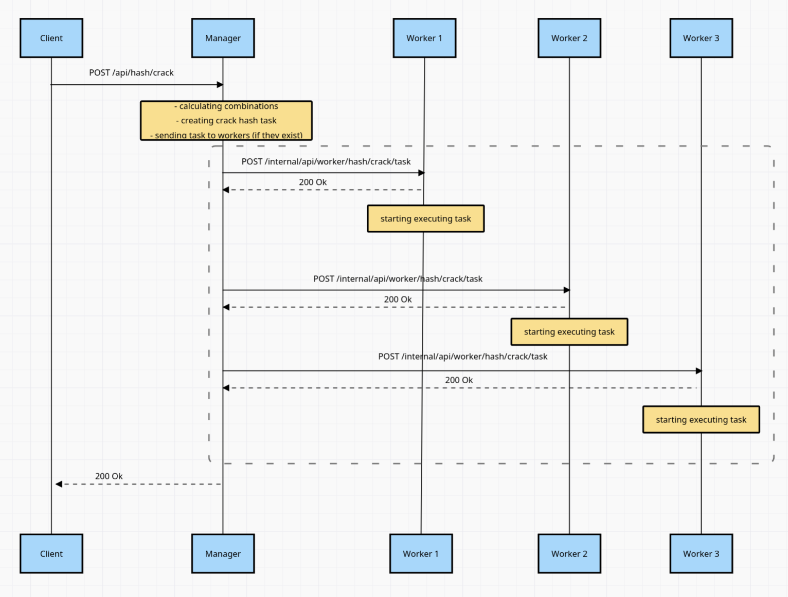
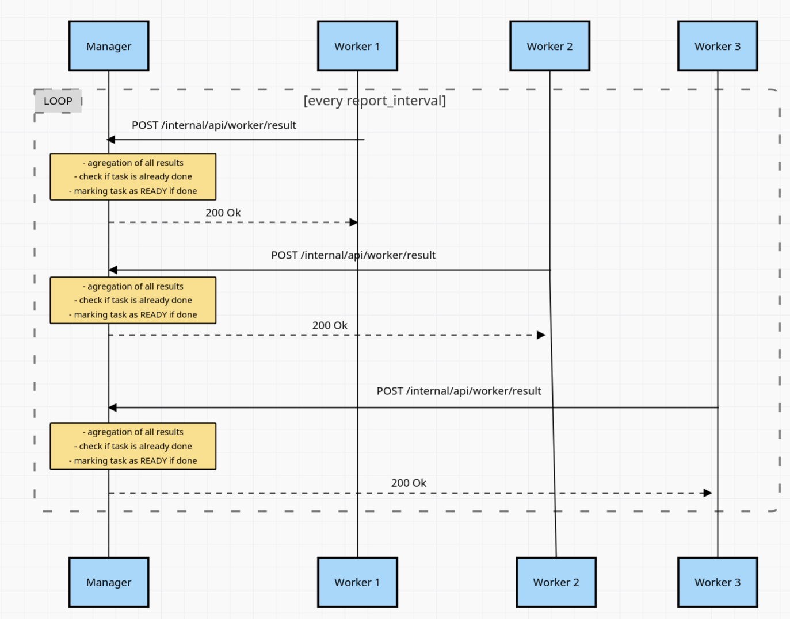
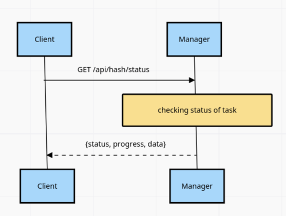
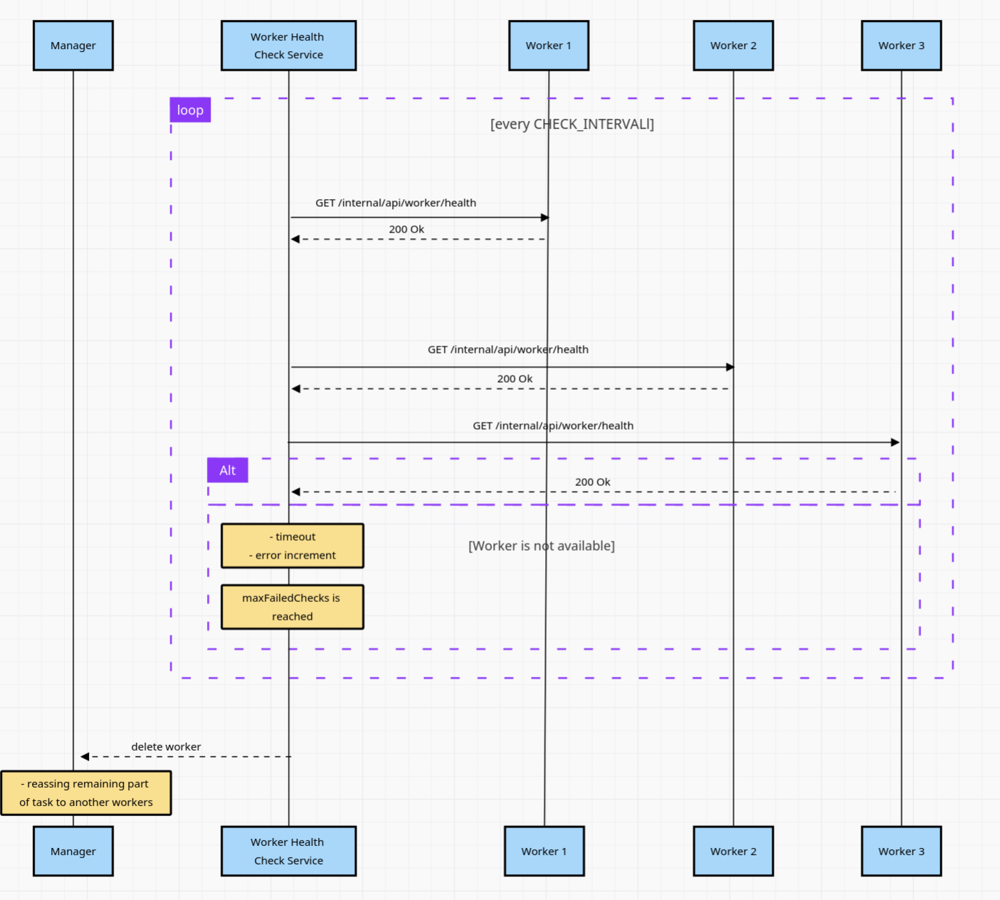

# distributed_information_systems_4_course_nsu

## Архитектура системы CrackHash

Система состоит из двух типов сервисов: Manager (менеджер) и Worker (воркер). Взаимодействие между ними осуществляется по HTTP внутри Docker-сети.
Manager (Менеджер)

### Менеджер — центральный компонент системы, который:

- Принимает REST-запросы от клиента на взлом хэша

- Управляет пулом воркеров (регистрация, health-чеки, отслеживание доступности)

- Разбивает общее пространство перебора на диапазоны индексов и распределяет задачи между воркерами

- Агрегирует промежуточные результаты от воркеров

- Отслеживает прогресс выполнения задачи и формирует итоговый ответ

- Хранит информацию о задачах и воркерах в оперативной памяти с использованием потокобезопасных коллекций (ConcurrentDictionary)

### Worker (Воркер)

Воркер — вычислительный узел, который:

- При запуске регистрируется в менеджере (передаёт своё имя и URL)

- Регулярно отвечает на health-запросы менеджера (эндпоинт /health)

- Получает от менеджера задачу: диапазон индексов [StartIndex, EndIndex], хэш для поиска, максимальную длину слова

- Генерирует слова итеративно по индексу (не хранит все комбинации в памяти) — полный перебор с использованием алфавита

- Вычисляет MD5-хэш для каждого слова и сравнивает с целевым

- При совпадении сохраняет найденное слово

- Каждые REPORT_INTERVAL (10 000) проверенных слов отправляет менеджеру отчёт с прогрессом и найденными словами

- Поддерживает отмену задачи по запросу менеджера (через CancellationToken)


### Схема взаимодействия компонентов
```
┌─────────────────────────────────────────────────────────────────────────────┐
│                                  CLIENT                                     │
│                                                                             │
│    POST /api/hash/crack         GET /api/hash/status?requestId=<UUID>       │
│    {hash, maxLength}            → {status, progress, data}                  │
└─────────────────────────────────────┬───────────────────────────────────────┘
                                      │
                                      │ External API (JSON)
                                      │
┌─────────────────────────────────────▼───────────────────────────────────────┐
│                           MANAGER SERVICE                                   │
│                              (Port 8080)                                    │
│                                                                             │
│  ┌─────────────────┐  ┌─────────────────┐  ┌─────────────────────────────┐  │
│  │ Task Management │  │ Worker Registry │  │ Progress & Health           │  │
│  │                 │  │                 │  │                             │  │
│  │ • Create tasks  │  │ • Registration  │  │ • Aggregate worker results  │  │
│  │ • Split ranges  │  │ • Health checks │  │ • Calculate total progress  │  │
│  │ • Distribute    │  │ • Track alive   │  │ • Detect timeouts           │  │
│  │ • Cancel tasks  │  │   workers       │  │ • Mark tasks as ERROR       │  │
│  └─────────────────┘  └─────────────────┘  └─────────────────────────────┘  │
└───────────┬─────────────────────────────────────────────────┬───────────────┘
            │                                                 │
            │ Internal API                   Progress Reports │
            │ POST /internal/api/worker/     (push model)     │
            │      hash/crack/task                            │
            │ POST /internal/api/worker/                      │
            │      hash/crack/cancel                          │
            │ GET  /internal/api/worker/health                │
            ▼                                                 │
┌───────────────────────────────────────────────────────────────────────────────┐
│                          WORKER SERVICES (1..N)                               │
│                                                                               │
│   ┌─────────────────────┐   ┌─────────────────────┐   ┌───────────────────┐   │
│   │     Worker 1        │   │     Worker 2        │   │    Worker 3       │   │
│   │  Range: [0, N/3)    │   │  Range: [N/3, 2N/3) │   │  Range: [2N/3, N] │   │
│   │                     │   │                     │   │                   │   │
│   │ • Word generation   │   │ • Word generation   │   │ • Word generation │   │
│   │ • MD5 hashing       │   │ • MD5 hashing       │   │ • MD5 hashing     │   │
│   │ • Progress reports  │   │ • Progress reports  │   │ • Progress reports│   │
│   │ • Cancel support    │   │ • Cancel support    │   │ • Cancel support  │   │
│   └─────────────────────┘   └─────────────────────┘   └───────────────────┘   │
└───────────────────────────────────────────────────────────────────────────────┘
```


## Sequence Diagrams

 

 

## Описание API

### External API (Manager) - для клиентов
Этот интерфейс предназначен для внешних клиентов, желающих отправить задание на взлом хэша или проверить его статус.

#### POST /api/hash/crack

Создание запроса на взлом хэша.

**Request:**

```json
{
  "hash": "e2fc714c4727ee9395f324cd2e7f331f",
  "maxLength": 4
}
```

**Response (200 OK):**

```json
{
  "requestId": "0160c0ac-5c32-4145-ac08-0ff3f9042401"
}
```

**Status Codes:**

- `200 OK` - запрос принят
- `400 Bad Request` - неверный формат запроса
- `500 Internal Server Error` - нет доступных воркеров или внутренняя ошибка

---

#### GET /api/hash/status

Получение статуса выполнения запроса.

**Parameters:**

- `crackId` - UUID запроса, полученный при создании

**Response (IN_PROGRESS):**

```json
{
  "status": "IN_PROGRESS",
  "progress": 65,
  "data": null
}
```

**Response (READY):**

```json
{
  "status": "READY",
  "progress": 100,
  "data": [
    "abcd"
  ]
}
```

**Response (ERROR):**

```json
{
  "status": "ERROR",
  "progress": 50,
  "data": null
}
```
---

### Internal API (Manager) - для воркеров
Этот интерфейс используется воркерами для регистрации в системе менеджера и отправки результатов. Не предназначен для внешних клиентов.


**Request:**

```json
{
    "workerName": "CoolName",
    "url": "http://worker-1:5000"
}
```

**Response (200 OK):**

```json
{
    "workerId": "a1b2c3d4-1111-2222-3333-444444444444"
}
```

#### POST /api/tasks/progress

Прием результатов выполнения части задачи от воркера.

**Request:**

```json
{
  "taskRequestId": "0160c0ac-5c32-4145-ac08-0ff3f9042401",
  "foundWords": [],
  "startIndex": 5000,
  "endIndex": 10000,
  "checkedCount": ,
  "isRequestDone": false,
}
```

---


### Internal API (Worker) - для менеджера


#### POST /api/v1/tasks/

Отправка воркеру части диапазона для перебора

**Request:**

```json
{
  "taskRequestId": "0160c0ac-5c32-4145-ac08-0ff3f9042401",
  "hash": "e2fc714c4727ee9395f324cd2e7f331f",
  "maxLength": 4,
  "startIndex": 0,
  "endIndex": 500000
}
```

## Инструкция по запуску

### Предварительные требования
- установленные  Docker и Docker Compose
- Python 3.12 (для запуска теста crack-test)


### Запуск системы в Docker
1. Настройка Docker

```
cd lab1/

# Добавить пользователя в группу docker
sudo usermod -aG docker $USER

# Применить изменения группы (или перелогиниться)
newgrp docker

# Проверить, что Docker работает
docker ps
```


2. Сборка и запуск контейнеров
```
# Остановить текущие контейнеры (если есть)
docker compose down

# Пересобрать образы
docker compose build --no-cache

# Запустить контейнеры
docker compose up
# или с сохранением логов в файл и выводом к консоль
docker compose up 2>&1 | tee logs.txt
```

### Запуск тестов
#### Через программу на python 
Микро тест для проверки =)
1. Настройка окружения для тестов
```
# Перейти в директорию с тестами
cd lab1/crack-test

# Установить venv (если не установлен)
sudo apt update
sudo apt install python3.12-venv

# Создать виртуальное окружение
python3 -m venv venv

# Активировать виртуальное окружение
source venv/bin/activate

# Установить зависимости
pip install requests
```

2. Запуск тестов
```
# Запустить тесты (убедитесь, что Docker контейнеры уже запущены)
python test_crack.py
```

3. Завершение работы с тестами
```
# Деактивировать виртуальное окружение
deactivate
```
#### Посмотреть через Swagger
если программа запущена в docker
[для воркера](http://localhost:8081/swagger/index.html) 
[для менеджера](http://localhost:8080/swagger/index.html) 